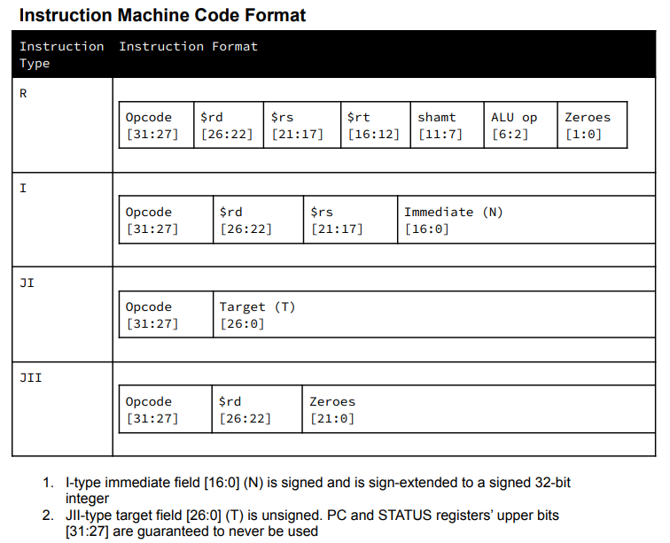
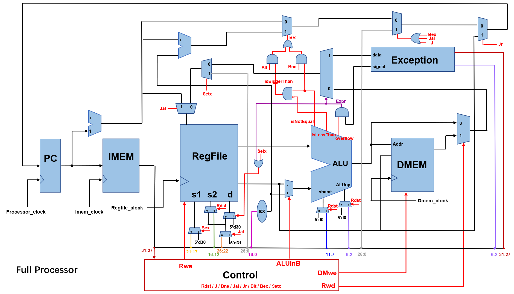

# Full Processor
## Author
    Kirk Xu  Patrick Peng  Yuhan Xue 
## Work
We implemented some basic functionalities of a processor. We implemented the following R-type, I-type and J-type instructions:    
_add, addi, sub, and, or, sll, sra, sw, lw, j, bne, jal, jr, blt, bex, setx._   

## Standard
   The instruction machine code format is provided, which is a **special version (different from common used version)**. The difference caused different datapath. The instruction format is shown below:   

   

## Implementation

Below is our circuit design, including the Imem, Dmem, Regfile and Processor.

   

 

   