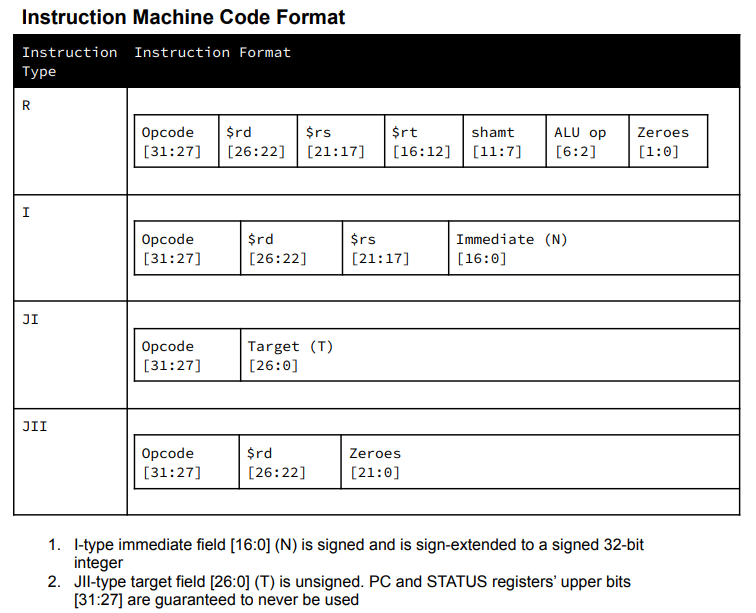
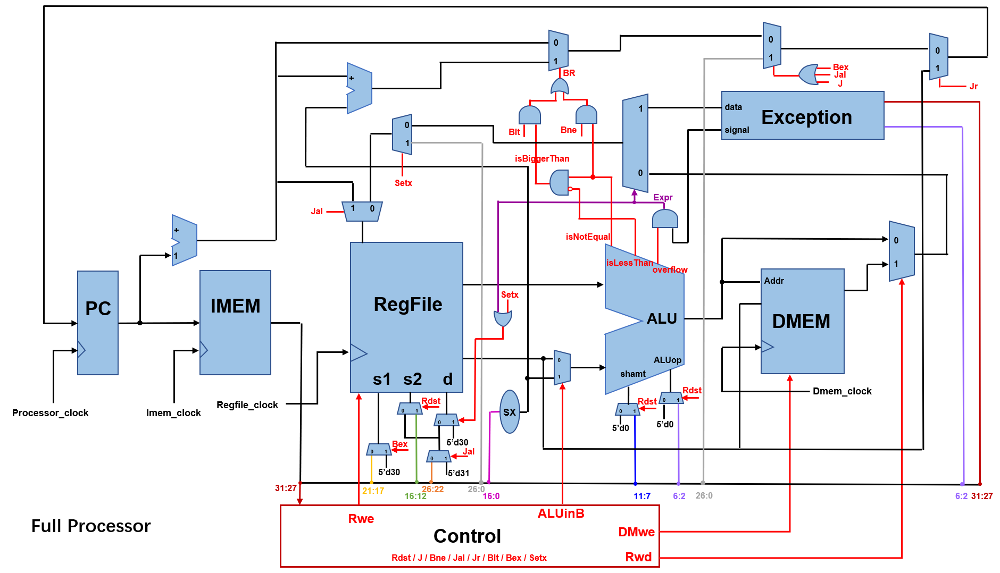

# Full Processor
## Author
    Kirk Xu (hx84)  Patrick Peng (jp550)  Yuhan Xue (yx167)
## Work
We implemented some basic functionalities of a processor. Based on the previous project, we implemented the following J-type instructions in this project:    
_j, bne, jal, jr, blt, bex, setx._   

## Standard
   The instruction machine code format is provided, which is a **special version (different from common used version)**. The difference caused different datapath. The instruction format is shown below:   

   

## Implementation

Below is our circuit design, including the Imem, Dmem, Regfile and Processor.

   

 

   